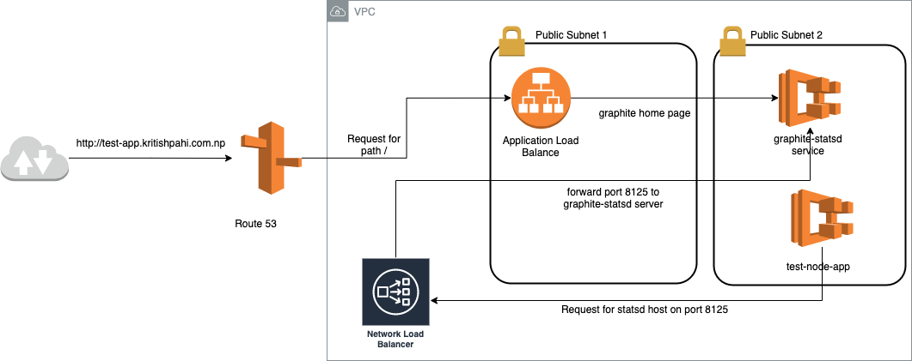

## Objectives

This test helps us to understand
- how do you approach infrastructure design
- how do you manage microservices communication
- how do you consider security implications

## Project Setup

Project root has [`index.js`](/index.js) file. It simulates a simple app that runs infinitely & sends metrics to a [`statsd`](https://github.com/statsd/statsd) server.

## Exercices

  1. Add a `Dockerfile` to containerize the app, with support for multiple environments (test, development & production)
  2. Add a `docker-compose.yml` file to setup Node app, `statsd` & the backend like `Graphite`.
  3. Use any IAC tools (Cloudformation, Terraform etc.) to prepare the infrastructure
  4. (Optional) Deploy on any cloud computing platforms

## Guide for Exercise.
### 1. Docker file
- For development mode, use volume mount inside the container. This way user don't have to install node,  nvm and other packages in their local machine.
  ```
  docker run --rm -it --name myTestApp \
  -v $PWD:/usr/src/app -w /usr/src/app \
  ```
- For building image:
    ``` 
    docker build -t my-app --build-arg MODE=production  .
    ```
- For additional build config according to evironment type (stage,production), use the $MODE in the Dockerfile.

### 2. Docker compose file
``` 
docker-compose up --build myapp statsd
```
This way docker compose will always build the image before running the containers. Otherwise compose will re-use the already built image.

### 3. Infrastrcture for the deployment.
The following are dependent infrastructure in order:
```
A. VPC   

B. Application Load balancer

C. Elastic Container Service (ECS) Cluster 

D. IaC for Graphite Statsd Service in ECS

E. IaC for Node App as Service in ECS
```


### 4. Deploy in AWS. (in the same order as above.)

```
A. make create-vpc-stack
B. make create-loadbalancer-stack
C. make create-ecs-cluster-stack
D. make create-graphite-statsd-service
E. make create-test-app-service

```
